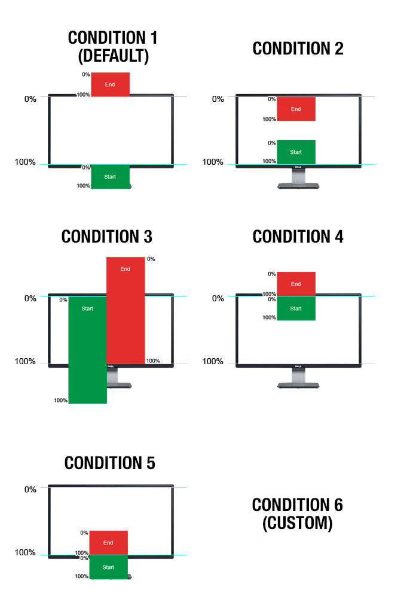

Control, control, control
==============================
I have determined that there are 5 different ways that you might need control your scrolling animations. Look at the visual aid below.

The 5 Element Positions
---
Since I'm a creative technologist this description of how it works is most likely going to be complicated. You target any of your elements and think about when it comes into view. Does the animation start as it comes into view, or does the animation wait until the entire element is on the screen? This whole system is based on percentages. The elements you target will have a point which activates the animation, and another point which deactivates it.

The logic here is to active when `what percentage of your element's height` is `less than what percentage of the screen's height` and vice-versa for deactivating. Confusing, i know. Here are the 6 element positions for activation and deactivation, and a handy graphic for explaining them.

 1. Activate when 0% is at 100%, deactivate when 100% is at 0%.
 2. Activate when 100% is at 100%, deactivate when 0% is at 0%.
 3. Activate when 0% is at 0%, deactivate when 100% is at 100%.
 4. Activate when 0% is at 0%, deactivate when 100% is at 0%.
 5. Activate when 0% is at 100%, deactivate when 100% is at 100%.

Here is how you use it.
--
#### Control a GSAP Timeline Animation ####
    var vs = require('vectorscroll');
    var elem = document.getElementById("#myTarget");

	vs(elem, myGSAPTimeline);

#### Customize the Scroll Condition ####
    var vs = require('vectorscroll');
    var elem = document.getElementById("#myTarget");

	vs(elem, myGSAPTimeline, {
		condition: 2
	});

#### Advanced - Condition 6 - Custom Everything ####
    var vs = require('vectorscroll');
    var elem = document.getElementById("#myTarget");

	vs(elem, myGSAPTimeline, {
		condition: 6,
		start: {
			when: "25%",
			is: "100%",
			vals: {
				step: 0
			},
			call: function(){
				console.log("this element has entered the start condition");
			}
		},
		end: {
			when: "75%",
			is: "0%",
			vals: {
				step: 255
			},
			call: function(){
				console.log("this element has left the end condition");
			}
		},
		scroll: function(vals) {
			console.log(vals); 
			// returns vals object with properties at their percentage through the states.
		}
	});

Power Options
---
If you look at condition 6, you'll notice a bunch of options. These are available for all of the above examples. You can leverage the time-saving features with the default condition, but also react when the element is within the condition's range.

	var vs = require('vectorscroll');
    var elem = document.getElementById("#myTarget");

	vs(elem, myGSAPTimeline, {
		start: {
			vals: {
				miles: 100
			}
		},
		end: {
			vals: {
				miles: 200
			}
		},
		scroll: function(vals) {
			console.log(vals)
		}
	});

Have fun
---
I've been building this for a long time. ScrollMagic.io has it's own approach, and has a huge user-base. I think it can even do the GSAP Timeline control stuff that this library does. So this is just another way to do it. Id love to hear your thoughts on it. 